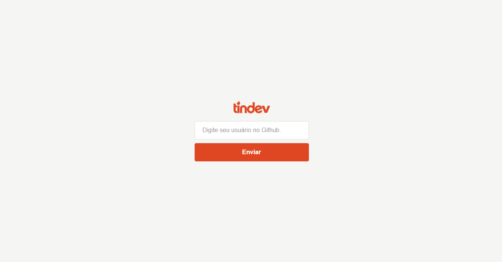
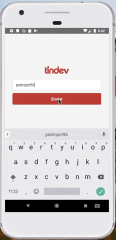

<h4 align="center">
<br>
 <b>A Tinder for devs</b> 
</h4>

<p align="center">
  

  
  
  <a href="https://github.com/Rocketseat/semana-omnistack-9/commits/master">
    
  </a>

  <a href="https://github.com/Rocketseat/semana-omnistack-9/issues">
    
  </a>

  
</p>

<p >
  
  
</p>

### 💻 Project

Aplicação Web, Android e iOS que simula um "Tinder" para desenvolvedores.

O projeto tem como objetivo final criar um clone do Tinder porém com a peculiaridade de ser um Tinder para Desenvolvedores(TindDev), em que o usuário logado utilizará sua conta do github e os usuários para Like ou Deslike também serão usuários do github.

## :rocket: Technologies

- [x] [NodeJs](https://nodejs.org/en/)
- [x] [ReactJs](https://github.com/reactjs/reactjs.org)
- [x] [React Native](https://github.com/facebook/react-native)
- [x] [Mongodb](https://www.mongodb.com/)
- [x] [Axios](https://github.com/axios/axios)
- [x] [socket.io](https://github.com/socketio/socket.io)
- [x] [express](https://github.com/expressjs/express)

### Prerequisites

Before you begin, you need to have installed the following tools:

<b>[Git](https://git-scm.com)</b>

<b>[Node.js](https://nodejs.org/en/)</b>

### 🧭 Running the Backend

```bash
# Clone this repository
$ git clone https://github.com/mschneider86/be-the-hero

# Access the project folder on terminal/prompt
$ cd tindev

# Go to backend folder
$ cd backend

# Install the dependencies
$ npm install ou yarn add

# Execute the application on dev mode
$ npm run dev ou yarn dev

# The server will start on port:3333 - access it on http://localhost:3333
```

### 🧭 Running the Frontend

```bash
# Clone this repository
$ git clone https://github.com/mschneider86/tindev

# Access the project folder on terminal/prompt
$ cd tindev

# Go to frontend folder
$ cd frontend

# Install the dependencies
$ npm install ou yarn add

# Execute the application
$ npm start ou yarn start

# The app will start on port:3000 - access it on http://localhost:3000
```

### 🧭 Running the Mobile

```bash
# Clone this repository
$ git clone https://github.com/mschneider86/tindev

# Access the project folder on terminal/prompt
$ cd tindev

# Go to Mobile folder
$ cd mobile

# Install the dependencies
$ npm install ou yarn add

# Start the app
$ expo start

```

## 🤔 How to contribute

- Fork this repo;
- Create a branch with your feature: 'git checkout -b my-feature';
- Commit your changes: `git commit -m 'feat: My new feature'`;
- Push to your branch: 'git push origin my-feature'.
